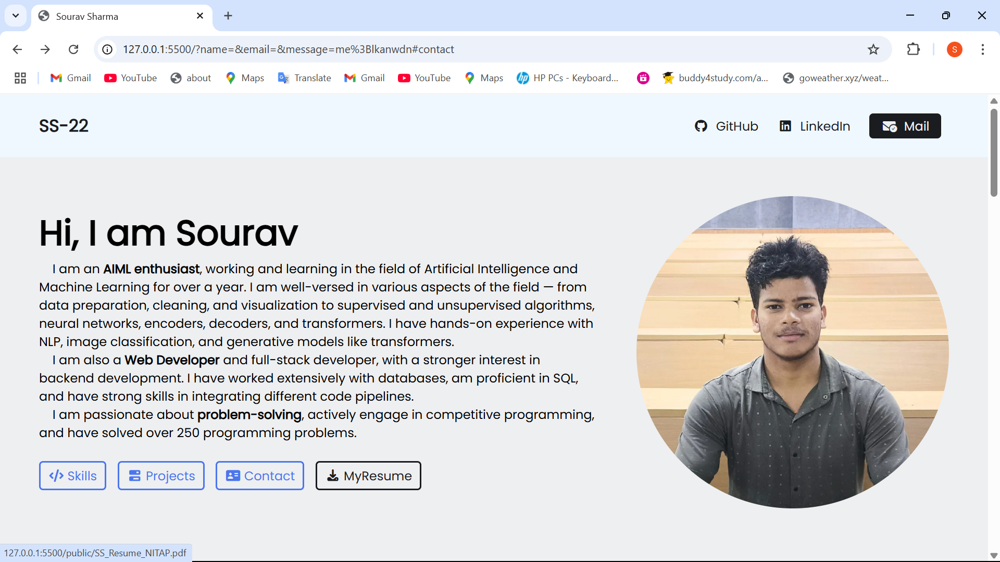
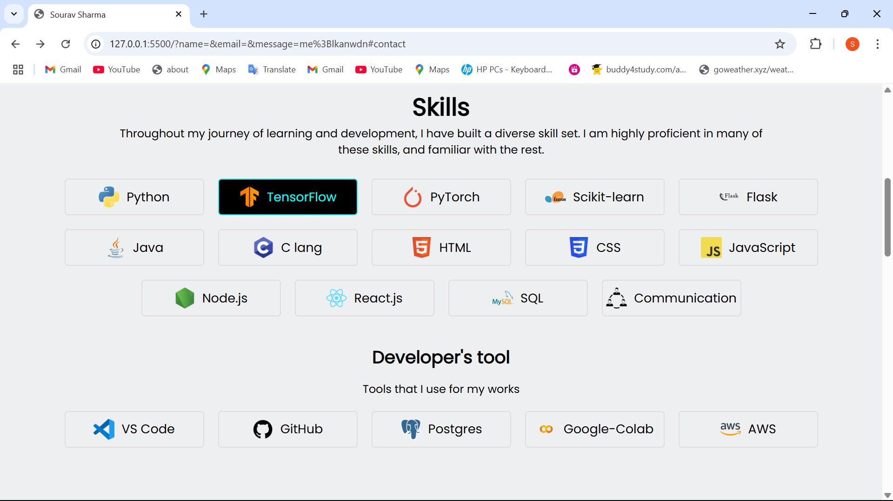

# 🌐 My Portfolio Website

A personal portfolio website showcasing my projects, skills, and experience.  
Built with **HTML** and **CSS**, it serves as a digital space to present my work, share my journey, and make it easier for others to connect with me.

---

## 🚀 Features
- 🖥 **Responsive Design** – Optimized for all devices (desktop, tablet, mobile).
- 📂 **Projects Showcase** – Highlights my work with descriptions and links.
- 🛠 **Skills Section** – Displays my technical and professional skills.
- 📞 **Contact Form** – Allows visitors to get in touch easily.
- 🎨 **Modern UI** – Clean and user-friendly design.

---

## 🛠 Tech Stack
- **Frontend:** HTML5, CSS3, JavaScript
- **Styling:** CSS Flexbox / Grid, Bootstrap (optional)
- **Icons & Fonts:** Font Awesome, Google Fonts
- **Hosting:** Vercel

---

## 📸 Screenshots

---

## 📬 Contact
If you’d like to connect or collaborate, feel free to reach out:

- **Email:** souravbgp2210@gmail.com  
- **LinkedIn:** [LinkedIn Profile](https://www.linkedin.com/in/sourav-sharma-12b589297/)  
- **GitHub:** [GitHub Profile](https://github.com/souravsharma22)  

---

